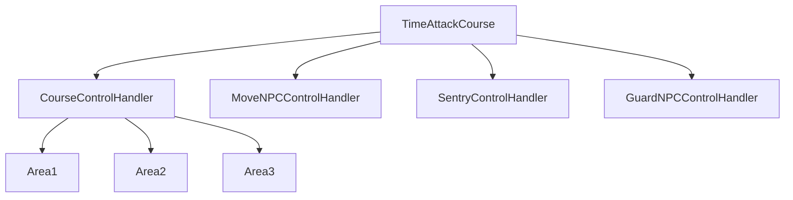
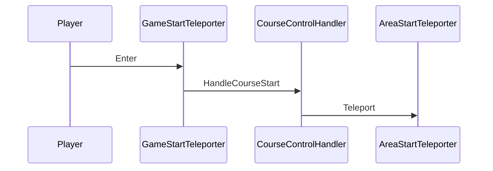
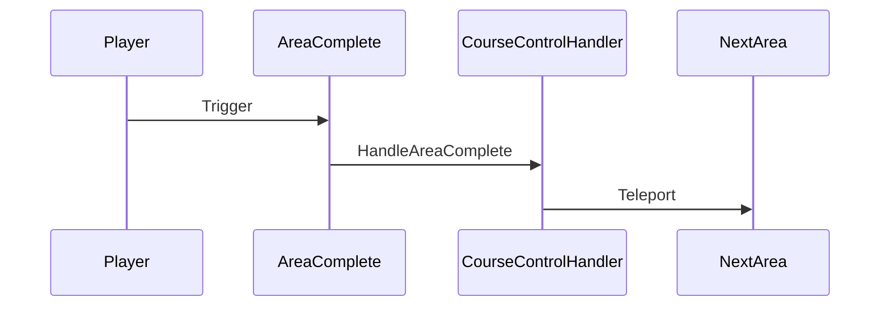

# コーステレポートシステム設計書

## 背景と目的
タイムアタックゲームモードにおいて、3つのコースそれぞれに3エリアを実装する必要があります。
プレイヤーがスムーズにコースを進行できるよう、適切なテレポートシステムを実装することが重要です。
本設計では、コース開始からエリア間の移動を管理するための基本システムを定義します。

## 対象ファイル
```
Plugins/VerseBlog/Content/
└── blog_template.verse   # メインデバイス
```

## 要件定義書

### 機能要件
1. コース管理
   - 3つ(複数追加可能)の独立したコースを管理できること
   - 各コースは3つ(複数追加可能)のエリアを持つこと
   - コースごとに独立して進行できること

2. テレポート制御
   - GameStartTeleporterからコースを開始できること
   - 各エリアのAreaStartTeleporterに正しくテレポートできること
   - エリア間の移動を制御できること

### 非機能要件
1. 拡張性
   - コース数の追加が容易であること
   - エリア数の変更が容易であること

2. 保守性
   - コードの重複を最小限に抑えること
   - 設定の変更が容易であること

3. 安定性
   - テレポート処理が確実に行われること
   - エラー発生時に適切にハンドリングできること

## 詳細設計

### システム概略


### クラス構成

1. 基本設定クラス
```verse
# エリア設定
CourseAreaSetting := class<concrete>():
    @editable
    var AreaStartTeleporter : teleporter_device = teleporter_device{}

# コース設定
CourseBaseSetting := class<concrete>():
    @editable
    var GameStartTeleporter : teleporter_device = teleporter_device{}
    @editable
    var Areas : []CourseAreaSetting = array{}
```

2. コース制御クラス
```verse
CourseControlHandler := class:
    @editable
    var CourseSetting : CourseBaseSetting = CourseBaseSetting{}
    var CurrentAreaIndex : int = 0
    var ActivePlayers : []agent = array{}
    
    # コース開始時の処理
    HandleCourseStart(Agent : agent) : void
    # エリア完了時の処理
    HandleAreaComplete(Agent : agent) : void
```

3. メインデバイスクラス
```verse
TimeAttackCourse := class(creative_device):
    @editable
    Course1Setting : CourseBaseSetting = CourseBaseSetting{}
    @editable
    Course2Setting : CourseBaseSetting = CourseBaseSetting{}
    @editable
    Course3Setting : CourseBaseSetting = CourseBaseSetting{}
    
    var CourseHandlers : []CourseControlHandler = array{}
```

### 機能詳細

1. コース開始フロー


2. エリア進行フロー


## ToDoリスト

### Phase 1: 基本実装
- [ ] CourseBaseSetting、CourseAreaSettingの実装
- [ ] CourseControlHandlerの基本機能実装
- [ ] テレポート処理の実装
- [ ] メインデバイスの実装

### Phase 2: 機能拡張
- [ ] プレイヤー管理機能の実装
- [ ] エラーハンドリングの実装
- [ ] デバッグログの実装

### Phase 3: テストと最適化
- [ ] 単体テストの実施
- [ ] 複数プレイヤーテストの実施
- [ ] パフォーマンス最適化 